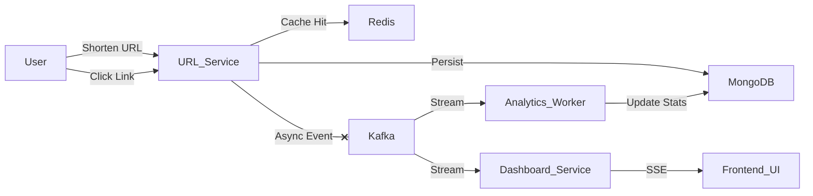

# Distributed URL Shortener with Real-Time Analytics 🚀

A scalable, distributed system that shortens URLs and streams click analytics in real-time. Built with **Node.js, Kafka, Redis, MongoDB, and Docker**.


## 🏗 Architecture

This project mimics a production-grade system design by decoupling the "write" path (shortening) from the "analytics" path (processing clicks).



## 🌟 Key Features

* **Microservices Architecture:** Three separate services handling unique responsibilities.
* **Event-Driven Analytics:** Uses **Apache Kafka** to decouple click tracking from user redirection (zero latency impact).
* **High-Performance Caching:** Uses **Redis** to serve redirects in <10ms without hitting the primary database.
* **Real-Time Dashboard:** Server-Sent Events (SSE) push live click updates to the frontend instantly.
* **Containerized:** Fully Dockerized infrastructure (Zookeeper, Kafka, Redis, MongoDB).

## 🛠 Tech Stack

* **Backend:** Node.js, Express.js
* **Message Broker:** Apache Kafka (Confluent Image)
* **Database:** MongoDB (Primary), Redis (Cache)
* **DevOps:** Docker, Docker Compose
* **Frontend:** HTML5, EventSource API (SSE)

## 🚀 Getting Started

### Prerequisites

* Docker & Docker Compose
* Node.js (v16+)

### 1. Start Infrastructure

Run the following command to spin up Kafka, Zookeeper, Redis, and MongoDB containers:

```bash
docker-compose up -d

```

### 2. Install Dependencies

Open three separate terminals for the microservices:

**Terminal 1 (URL Service):**

```bash
cd services/url-service
npm install
node index.js

```

**Terminal 2 (Analytics Worker):**

```bash
cd services/analytics-worker
npm install
node index.js

```

**Terminal 3 (Real-Time Dashboard):**

```bash
cd services/dashboard-service
npm install
node index.js

```

## 📡 Usage

### 1. Open the Dashboard

Visit `http://localhost:4000` in your browser. You will see the live event stream waiting for data.

### 2. Shorten a URL

Send a POST request to generate a short link.

**Mac/Linux (Curl):**

```bash
curl -X POST http://localhost:3000/shorten \
     -H "Content-Type: application/json" \
     -d '{"originalUrl": "[https://www.google.com](https://www.google.com)"}'

```

**Windows (PowerShell):**

```powershell
Invoke-RestMethod -Uri "http://localhost:3000/shorten" -Method Post -ContentType "application/json" -Body '{"originalUrl": "[https://www.google.com](https://www.google.com)"}'

```

### 3. Test Redirection

Copy the `shortUrl` from the response (e.g., `http://localhost:3000/AbCd12`) and paste it into your browser.

* You will be redirected to the original link.
* **Check the Dashboard tab:** You will see the click event appear instantly!

## 📂 Project Structure

```text
├── docker-compose.yml        # Infra configuration (Kafka, Redis, Mongo)
├── services
│   ├── url-service           # REST API for shortening & redirecting
│   ├── analytics-worker      # Kafka consumer that updates DB stats
│   └── dashboard-service     # SSE server for real-time frontend updates
└── README.md

```

## 🔮 Future Improvements

* Implement a Dead Letter Queue (DLQ) for failed Kafka messages.
* Add Prometheus & Grafana for system metric visualization.
* Add user authentication (API Keys) for link creation.
